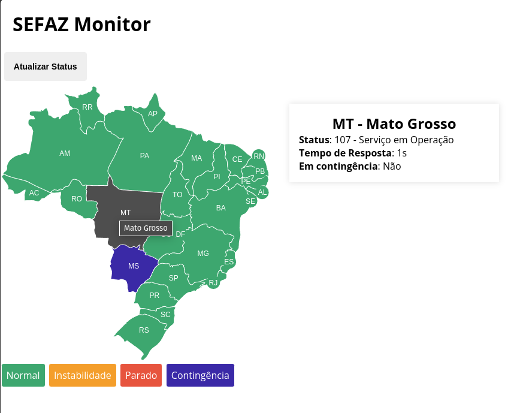

# Sefaz Monitor

Disponibiliza um mapa do Brasil e informa o status da NF-e para cada estado, utilizando o webservice NfeStatusServico



## Objetivos de aprendizado

- Curl
- Protocolo SOAP

## Requisitos

- [x] Como usuário gostaria de visualizar um mapa interativo do Brasil. Quando passar o mouse sobre cada estado, um
      card deve ser atualizado com as informações do webservice do estado (Tempo médio de resposta, se esta em contigência).
- [x] Como um usuário gostaria de um botão **Atualizar** que, quando clicado atualize as informações dos estados.
- [x] Fazer a consulta ao servidor de contingência para verificar se esta habilitado.
- [x] Como usuário gostária que houvesse legendas dos status (por exemplo: Normal, Parado, Contigência).

## Implementações futuras

- [ ] Criar um processo **cronjob** que ficará realizando a consulta de tempos em tempos.
- [ ] Encaminhar informações para o front, sempre que o status atualizar.
- [ ] Refatorar: temos esses serviços para CT-e também e provavelmente outros documentos, como deixar o fluxo genérico o suficiente para
      permitir adicionar esses outros documentos sem muitas alterações.
- [ ] Implementar testes.
- [ ] Implementar cadastro da empresa e certificado.

## Como executar

Siga esses passos para executar a aplicação

Acesse o diretório docker:

```sh
cd docker
```

Build e start o container:

```sh
docker-compose up -d --build
```

Acesse em [http://localhost:8080](http://localhost:8080)

Gere os arquivos client.pem e key.pem atráves do seu certificado digital no formato .p12 ou .pfx

```sh
# Extrair chave.pem
openssl pkcs12 -in [caminho para o certificado] -out storage/key.pem -nocerts -nodes

# Extrair cliente.pem
openssl pkcs12 -in [caminho para o certificado] -out storage/client.pem -clcerts -nokeys -nodes
```

Altere

## Créditos

Adaptação do Mapa do Brasil em SVG do [Felipe Duardo](https://github.com/felipeduardo/mapa-brasil-svg)

## Links adicionas e resources

- https://www.php.net/manual/en/book.curl.php
- https://en.wikipedia.org/wiki/SOAP
- https://www.youtube.com/watch?v=it8ybkQuAh8
- https://www.youtube.com/watch?v=-Pa0t8pRmDM
- https://www.w3.org/TR/2000/NOTE-SOAP-20000508/
- https://www.w3.org/TR/soap12-part1/

### Execução de processamento

- https://eximia.co/desacoplando-a-execucao-de-jobs-pesados-ou-recorrentes-com-hangfire-em-net/
- https://www.youtube.com/watch?v=GsdfZ5TfGPw
- https://www.youtube.com/watch?v=p1D4FkFyoFA
- https://www.youtube.com/watch?v=Zn4HahsFAbY

## Javascript

- https://www.braziljs.org/p/diferencas-entre-async-e-defer
- https://www.freecodecamp.org/portuguese/news/o-metodo-addeventlistener-exemplo-de-codigo-com-listener-de-eventos-em-javascript/

# Framework

- https://laravel.com/docs/11.x/routing#required-parameters
- https://symfony.com/doc/current/create_framework/index.html
